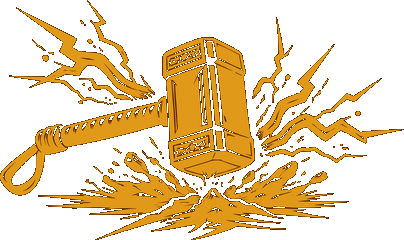

A terminal-based AI coding agent built in Go. Fast, beautiful, concurrent.</p>

Works with local LLMs (Ollama) and cloud providers (OpenAI, Anthropic, AWS Bedrock, DeepSeek, Alibaba Cloud).

```
  ⚡ forge • ollama/llama3
  ❯ fix the null pointer in main.go

  ● Read main.go
    main.go (23 lines)

  I found the issue on line 14...

  ● Write main.go
    main.go (23 lines written)

  Fixed. The nil pointer was caused by...
```

## Install

**macOS:**
```bash
brew tap forge-cli/tap && brew install forge
```

**Windows:**
```powershell
scoop bucket add forge https://github.com/forge-cli/scoop-bucket
scoop install forge
```

**One-liner:**
```bash
curl -fsSL https://forge-cli.dev/install.sh | sh
```

## Quick Start

```bash
# Start chatting with your default model
forge chat

# Auto-approve all tool calls (no confirmation prompts)
forge chat --yes

# Log prompts and responses to a file
forge chat --log out/chat.txt

# Use a custom system prompt
forge chat --system-prompt "You are a Go expert. Always suggest idiomatic Go."

# Load system prompt from a file
forge chat --system-prompt-file ./prompts/reviewer.md

# Ask a one-off question
forge ask "explain this error" --file main.go

# Start the REST API server
forge serve --port 8080

# Use a specific provider
forge chat --provider openai --model gpt-4o

# List available models
forge models
```

On first run, Forge will prompt you to select a provider and model.

## Features

- **Concurrent tool execution** — multiple file reads, searches, and commands run in parallel
- **Streaming responses** — tokens appear instantly as the model generates them
- **Rich terminal UI** — Kiro-style output with colored bullets, action verbs, and detail lines
- **REST API server** — `forge serve` exposes a JSON API for external tool integration
- **Multi-provider** — switch between local and cloud models with a flag
- **Safe by default** — destructive operations require confirmation, project boundary enforcement
- **Auto-approve mode** — `--yes` flag skips all confirmation prompts
- **Zero dependencies** — single static binary, built entirely with Go's standard library

## Providers

| Provider | Local | Tool Calling | Auth |
|----------|-------|-------------|------|
| Ollama | Yes | Varies by model | None |
| OpenAI | No | Full | API key |
| Anthropic | No | Full | API key |
| AWS Bedrock | No | Full | AWS credentials |
| DeepSeek | No | Partial | API key |
| Alibaba (DashScope) | No | Full | API key |

## Configuration

Config lives at `~/.forge/config.json`. Set your default provider and model:

```json
{
  "default_provider": "ollama",
  "providers": {
    "ollama": {
      "host": "http://localhost:11434",
      "model": "llama3"
    }
  }
}
```

API keys are read from environment variables — never stored in the config file.

See [docs/config.md](docs/config.md) for the full reference.

## Commands

| Command | Description |
|---------|-------------|
| `forge chat` | Interactive chat session (default) |
| `forge chat --yes` | Chat with auto-approved tool calls |
| `forge chat --log out/chat.txt` | Chat with prompt/response logging |
| `forge chat --system-prompt "..."` | Chat with a custom system prompt |
| `forge chat --system-prompt-file p.md` | Chat with system prompt from file |
| `forge ask "<prompt>"` | Single-shot query |
| `forge serve --port 8080` | Start REST API server |
| `forge models` | List available models |
| `forge version` | Print version |

## Build from Source

```bash
git clone https://github.com/forge-cli/forge.git
cd forge
make build
./bin/forge chat
```

Requires Go 1.22+.

## Documentation

- [Architecture](docs/architecture.md)
- [Providers](docs/providers.md)
- [Prompts](docs/prompts.md)
- [Tools](docs/tools.md)
- [Configuration](docs/config.md)
- [Contributing](docs/contributing.md)
- [Specs](docs/specs.md)
- [Backlog](docs/backlog.md)

## License

MIT
